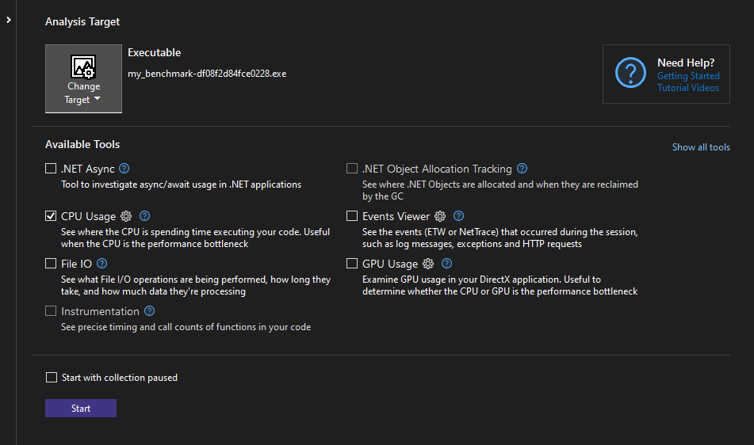

# reloaded-hooks

[](https://crates.io/crates/reloaded-hooks)
[](https://docs.rs/reloaded-hooks)
[](https://github.com/Reloaded-Project/Reloaded.Hooks-rs/actions)

## About

Advanced native function hooks for x86, x64. Now in Rust, and cross platform too!
You can learn more about this project in the [dedicated documentation page][docs].

## Development

How to develop this project.

***Clone this Repository:***
```bash
# When cloning, make sure symlinks are enabled
git clone -c core.symlinks=true https://github.com/Reloaded-Project/Reloaded.Hooks-rs.git
```

***Install Rust:***
- Install the [Rust Toolchain.][rust-toolchain]  

***Setup IDE***
- This repository is fully with VSCode. [Guidance below](#visual-studio-code-integration).

### Visual Studio Code Integration

`Code`/`VSCode` is the de-facto Rust development environment.  

The following extensions are required:  
- [rust-analyzer][rust-analyzer] for Rust support.  
- [coverage-gutters][coverage-gutters] for Coverage support.  
- [CodeLLDB][codelldb] for debugging.  
- [crates](https://marketplace.visualstudio.com/items?itemName=serayuzgur.crates) easier dependency management.  

The VSCode configuration in Reloaded projects (`.vscode`) contain the following:  
- Run Rust linter `clippy` on Save.  
- Run code format `rustfmt` on Save.  
- Tasks for common operations (generate documentation, active CI/CD etc.).  

These configurations are in the `.vscode` folder; and the tasks can be ran via `Ctrl+Shift+P -> Run Task`.  

#### Test Coverage

To run Coverage, run task (`Ctrl+Shift+P -> Run Task`), you should see: 

| Task                   | Description                                                                |
| ---------------------- | -------------------------------------------------------------------------- |
| Cargo Watch Tarpaulin  | Automatically runs tests and updates coverage on save.                     |
| Generate Code Coverage | Manually generate code coverage (`cobertura.xml`, `tarpaulin-report.html`) |

The `tarpaulin-report.html` file can be opened in VSCode (`Show Preview`) for a live view.

For GUI integration, run action `Coverage Gutter: Watch` (in `Ctrl+Shift+P` actions menu).

## Debugging Benchmarks

If you wish to debug benchmarks in VSCode, go to `Run and Debug` Menu and generate the launch 
profiles, you should get one for debugging benchmarks.

## Profiling Benchmarks

### Linux/OSX

Execute the following:

```
cargo bench --bench my_benchmark --profile profile -- --profile-time 10
```

This should give you a flamegraph in `target/criterion/<method_name>/profile`. You can open that flamegraph in a web browser.

### Windows

Execute the following:

```
cargo bench --bench my_benchmark --no-run --profile profile
```

Navigate to the executable listed in the commandline:

```
target/profile/deps/my_benchmark-eced832ac8f31257.exe
```

And run with command `my_benchmark-eced832ac8f31257.exe --bench --profile-time 10` under an external profiler, such as Visual Studio.  



## Optimizing for Size when Creating C Libraries

1. Add `"cdylib"` crate type to `Cargo.toml` (if not already present)

```
[lib]
crate-type = ["cdylib"]
```

Install `cargo-bloat`, `nightly toolchain` and `build-std`:

```
cargo install cargo-bloat
rustup toolchain install nightly
rustup component add rust-src --toolchain nightly
```

Run `cargo-bloat` the following command to calculate package size:

```
cargo +nightly bloat --profile profile -Z build-std=std,panic_abort -Z build-std-features=panic_immediate_abort --target x86_64-unknown-linux-gnu -n 100
```

Change `--target` if needed for your platform.  
This should produce binaries more appropriate for dynamic linking from C.  

## File Layout

Individual projects are under the `projects` folder; they contain the following:  

- `reloaded-hooks-portable`: Core engine of `Reloaded.Hooks`, platform & architecture agnostic.  
- `reloaded-hooks-x86-sys`: Implements support for x86 & AMD64 architecture.  
- `reloaded-hooks-aarch64-sys`: Implements support for ARM64 (aarch64) architecture.  
- `reloaded-hooks-buffers-common`: Improves support on Linux/macOS/Windows by adding targeted memory allocation capabilities. Using [reloaded-memory-buffers][reloaded-memory-buffers].  
- `reloaded-hooks`: High level API for the `Reloaded.Hooks` packages.  

The following is the expected file layout for the repository:

```
.vscode/
docs/
mkdocs.yml
```

The `docs` folder, and `mkdocs.yml` contain [MkDocs Material documentation][mkdocs-material] for your project.  

## Cross Platform Targeting

Some templates allow for cross platform development.  

To work with cross-platform code, where you need to access OS specific APIs, some helper scripts are provided.  

### Including All Code Paths

To include all code paths for local builds, consider editing `.cargo/config.toml`.

```toml
[build]
# Note: This breaks IntelliJ Rust. Remove this line temporarily if working from that IDE.
target = ['x86_64-unknown-linux-gnu','x86_64-apple-darwin','x86_64-pc-windows-gnu']
```

You might need to install the targets first:

```bash
rustup target add x86_64-unknown-linux-gnu
rustup target add x86_64-apple-darwin
rustup target add x86_64-pc-windows-gnu
```

Now when you run `cargo build`, it will build code for all platforms; and you'll get your compiler errors, warnings etc.

### Cross Testing on Local Machine

#### Prerequisites (Windows)

- Install [Docker Desktop](https://www.docker.com/products/docker-desktop/).  
- Disable WSL 2 (Docker Desktop -> Settings -> General -> Use the WSL 2 based engine).  

#### Prerequisites (Linux)

- Install [Podman](https://podman.io) from your package manager.  

#### Prerequisites (Common)

Install cross

```
cargo install cross
```

#### Running Cross-Platform Tests

Use the provided `pwsh` scripts in `scripts` folder.

- `./test-wine-x64.ps1`: Tests your code in Wine on x86_64.  
- `./test-linux-x64.ps1`: Tests your code in Linux on x86_64.  
- `./test-linux-x86.ps1`: Tests your code in Linux on x86.  

These scripts can be used on any platform given the prerequisites are met.  
If you need to test Apple stuff without an Apple machine, you're generally out of luck outside of using CI/CD for testing.  

## Contributing

See [CONTRIBUTING](CONTRIBUTING.MD) for guidance on how to contribute to this project.  

## License

Licensed under [GPL V3 w/ Reloaded FAQ](./LICENSE), the default for Reloaded project.  
[Learn more about Reloaded's choice of licensing.][reloaded-license].  

[codecov]: https://about.codecov.io/
[codelldb]: https://marketplace.visualstudio.com/items?itemName=vadimcn.vscode-lldb
[coverage-gutters]: https://marketplace.visualstudio.com/items?itemName=ryanluker.vscode-coverage-gutters 
[crates-io-key]: https://crates.io/settings/tokens
[docs]: https://reloaded-project.github.io/Reloaded.Hooks-rs
[mkdocs-material]: https://squidfunk.github.io/mkdocs-material/
[reloaded-license]: https://reloaded-project.github.io/Reloaded.MkDocsMaterial.Themes.R2/Pages/license/
[reloaded-memory-buffers]: https://crates.io/crates/reloaded_memory_buffers
[rust-analyzer]: https://marketplace.visualstudio.com/items?itemName=rust-lang.rust-analyzer
[rust-toolchain]: https://www.rust-lang.org/tools/install
