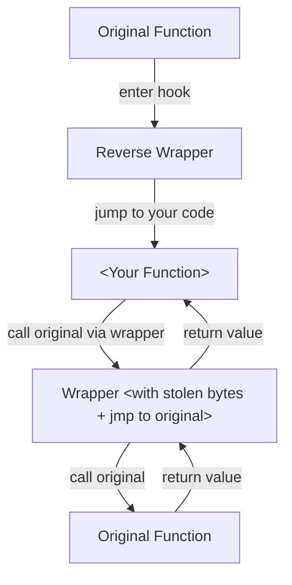
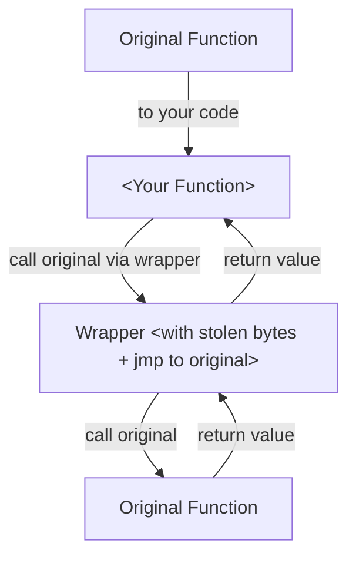
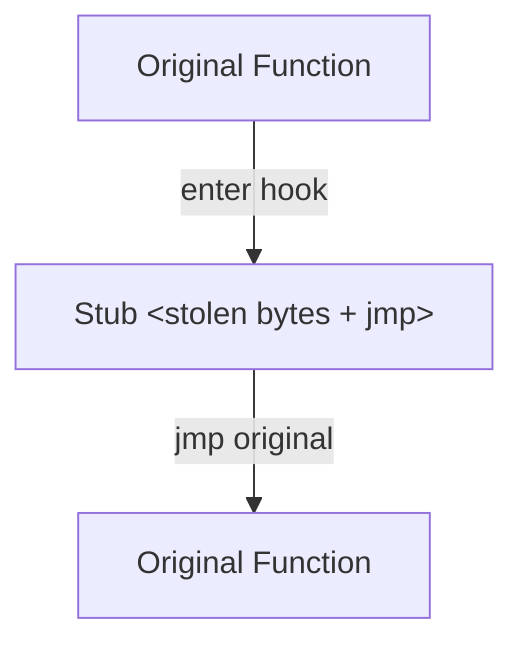

# Hook Design

!!! info "I'm not a security person/researcher. I just make full stack game modding tools, mods and libraries. Naming in these design docs might be unconventional."

## High Level Diagram

### Key

- `Stolen Bytes`: Bytes used by instructions sacrificed in original function to place a 'jmp' to the `ReverseWrapper`.  
- `ReverseWrapper`: Translates from original function calling convention to yours. Then calls your function.  
- `<Your Function>`: Your Rust/C#/C++/Asm code.  
- `Wrapper`: Translates from your calling convention to original, then runs the original function.  

### When Activated

When the hook is activated, a stub calls into your function; which becomes the 'new original function';
that is, control will return (`ret`) to the original function's caller from this function.

When your function calls the original function, it will be an entirely separate method call.

### When Activated in 'Fast Mode'

!!! info "'Fast Mode' is an optimisation that inserts the `jmp` to point directly into your code when possible."

This option allows for a small performance improvement, saving 1 instruction and some instruction prefetching load.  

This is on by default, and will take into effect when no conversion between calling conventions is needed.  

When conversion is needed, the logic will default back to [When Activated](#when-activated).  

### When Deactivated

!!! note "Does not apply to 'Fast Mode'. When in fast mode, deactivation returns error."

When you deactivate a hook, the contents of 'Reverse Wrapper' are overwritten with the stolen bytes.  

!!! note "When 'Reverse Wrapper' is allocated, extra space is reserved for original code."

By bypassing your code entirely, it is safe for your dynamic library (`.dll`/`.so`/`.dylib`) 
to unload from the process.

## Calling Convention Inference

!!! note "It is recommended library users manually specify conventions in their hook functions."

When the calling convention of `<your function>` is not specified, wrapper libraries must insert
the appropriate default convention in their wrappers.

!!! danger "On Linux, ***syscalls*** use R10 instead of RCX in SystemV ABI"

### Rust

- `i686-pc-windows-gnu`: cdecl
- `i686-pc-windows-msvc`: cdecl
- `i686-unknown-linux-gnu`: SystemV (x86)

- `x86_64-pc-windows-gnu`: Microsoft x64
- `x86_64-pc-windows-msvc`: Microsoft x64
- `x86_64-unknown-linux-gnu`: SystemV (x64)

- `x86_64-apple-darwin`: SystemV (x64)

### C#

- `Windows x86`: cdecl
- `Windows x64`: Microsoft x64

- `Linux x64`: SystemV (x64)
- `Linux x86`: SystemV (x86)

- `macOS x64`: SystemV (x64)

## Wrapper(s)

!!! info "Wrappers are stubs which convert from the calling convention of the original function to your calling convention."

!!! note "If the calling convention of the hooked function and your function matches, this wrapper is simply just 1 `jmp` instruction."

## ReverseWrapper(s)

!!! info "Stub which converts from your code's calling convention to original function's calling convention"

!!! info "This is basically [Wrapper](#wrappers) with `source` and `destination` swapped around"