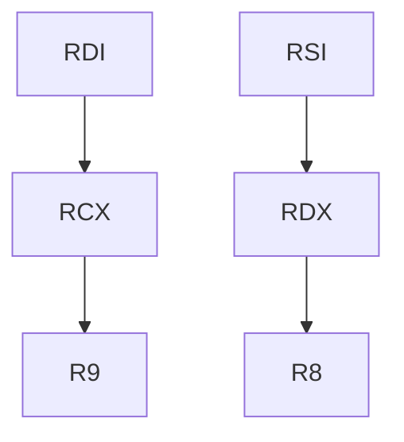
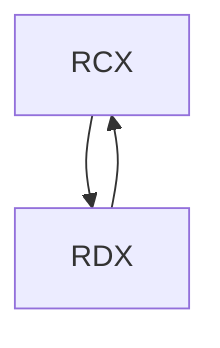
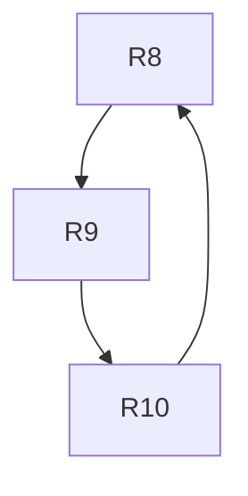
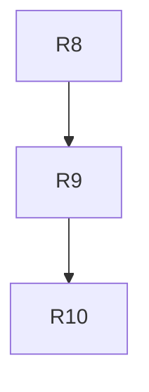

# Calling Conversion Wrappers

!!! info "Describes how stubs for converting between different Calling Conventions (ABIs) are generated."

!!! info "This page uses x86 as an example, however the same concepts apply to other architectures."

## General Strategy

- Backup Stack Frame & Non-Volatile Registers

```asm
push ebp
mov ebp, esp

# Save non-volatile registers
push ebx
push edi
push esi
```

- Reserve Extra Stack Space

Some compiler optimised you hook require you to reserve stack space up front. So we reserve it

```asm
sub esp, {whatever}
```

- Setup Function Parameters
    - Re push stack parameters (right to left) of the function being returned

    ```asm
    # In a loop
    push dword [ebp + {baseStackOffset}]
    ```

    - Push register parameters of the function being returned (right to left, reverse loop)
    - Pop parameters into registers of function being called

- Call Target Method
- Setup Return Register
    
If target function returns in different register than caller expects, might need to for example `mov eax, ecx`.

```asm
mov eax, ecx
```

- Restore Stack Frame & Non-Volatile Registers

```asm
# Restore non-volatile registers
pop esi
pop edi
pop ebx

push ebp
ret
```

!!! tip "The general implementation for 64-bit is the same, however the stack must be 16 byte aligned at method entry, and for MSFT convention, 32 bytes reserved on stack before call"

## Optimization

### Align Wrappers to 16 Byte Addresses

!!! tip "This optimizes CPU instruction fetch, which operates on 16 byte boundaries."

So we align our wrappers to these boundaries.

### Eliminate Callee Saved Registers

!!! info "When there are overlaps in callee saved registers between source and target, we can skip backing up those registers."

For example, `cdecl` and `stdcall` use the same callee saved registers, `ebp`, `ebx`, `esi`, `edi`. When converting between these two conventions, it is not necessary to backup/restore any of them in the wrapper, because the target function will already take care of that.


Example: `cdecl target -> stdcall` wrapper.

=== "Before"

    ```asm
    # Stack Backup
    push ebp
    mov ebp, esp

    # Callee Save
    push ebx
    push edi
    push esi

    # Re push parameters
    push dword [ebp + {x}]
    push dword [ebp + {x}]

    call {function}
    add esp, 8

    # Callee Restore
    pop esi
    pop edi
    pop ebx

    # Stack Restore
    pop ebp
    ret 8
    ```

=== "After"

    ```asm
    # Stack Backup
    push ebp
    mov ebp, esp

    # Re push parameters
    push dword [ebp + {x}]
    push dword [ebp + {x}]

    call {function}
    add esp, 8

    # Stack Restore
    pop ebp
    ret 8
    ```

!!! note "Pseudocode example. Not verified for accuracy, but it shows the idea"

In the `cdecl -> stdcall` example, `ebp` is considered a callee saved register too, thus it should be possible to optimise into:

```asm
# Re push parameters
push dword [esp + {x}]
push dword [esp + {x}]

call {function}
add esp, 8

ret 8
```

### Move Between Registers Instead of Push Pop

!!! tip "In some cases it's possible to mov between registers, rather than doing an explicit push+pop operation"

Suppose you have a `custom target -> stdcall` wrapper. Custom is defined as `int@eax FastAdd(int a@eax, int b@ecx)`.  

Normally wrapper generation will convert the arguments like this:  

```asm
# Re-push STDCALL arguments to stack
push dword [esp + {x}]
push dword [esp + {x}]

# Pop into correct registers
pop eax
pop ecx

# Call that function
# ...
```

There's opportunities for optimisation here; notably you can do:

```asm
# Pop into correct registers
mov eax, [esp + {x}]
mov ecx, [esp + {x}]

# Call that function
# ...
```

Optimising cases where the source/from convention, e.g. `custom target -> stdcall` has no register 
parameters is trivial, since you can directly mov into the intended target register. And this is 
the most common use case in x86.

For completeness, it should be noted that in the opposite direction `stdcall target -> custom`, such
as one that would be used in entry point of a hook ([ReverseWrapper](./overview.md#reversewrappers)),
no optimisation is needed here, as all registers are directly pushed without any extra steps.

#### With Register to Register

!!! info "In x64, and more advanced x86 scenarios where both to/from calling convention have register parameters, mov optimisation is not trivial."

##### Basic Case

Suppose you have a a function to add 'health' to a character that's in a struct or class. i.e. `int AddHealth(Player* this, int amount)`. 
(Note: The 'this' parameter to struct instance is implicit and added during compilation.)

=== "C++"

    ```cpp
    class Player {
        int mana;
        int health;

        void AddHealth(int amount) {
            health += amount;
        }
    };
    ```

=== "x64 asm (SystemV)"

    ```asm
    add dword [rdi+4], esi
    ret
    ```

    [See for yourself.](https://godbolt.org/z/js4Esav19)

=== "x64 asm (Microsoft)"

    ```asm
    add dword [rcx+4], edx
    ret
    ```

    [See for yourself.](https://godbolt.org/z/n8Ev5z5cW)

If you were to make a `SystemV target -> Microsoft` wrapper; you would have to move the two registers
from `rcx, rdx` to `rdi, rsi`.

Therefore, a wrapper might have code that looks something like:  

```asm
# Push register parameters of the function being returned (right to left, reverse loop)
push rdx
push rcx

# Pop parameters into registers of function being called
pop rdi
pop rsi
```

In this case, it is possible to optimise with:

```asm
mov rdi, rcx # last push, first pop
mov rsi, rdx # second last push, second pop
```

Provided that the wrapper correctly saves and restores callee moved registers for returned method, i.e.
backs up `RBX, RBP, RDI, RSI, RSP, R12, R13, R14, and R15`, this is fine.

Or in the case of this wrapper, just `RDI, RSI` (due to overlap within the 2 conventions).

!!! note "The 'strategy' to generate code for this optimisation is keeping track of stack, start between `push` and `pop` in the ASM and pair the registers in the corresponding `push` and `pop` operations together, going outwards until there is no push/pop left."

##### Advanced Case

!!! tip "This is just another example."
 
Suppose we add 2 more parameters...

=== "C++"

    ```cpp
    class Player {
        int mana;
        int health;
        int money;

        void AddStats(int health, int mana, int money) {
            this->health += health;
            this->mana += mana;
            this->money += money;
        }
    };
    ```

=== "x64 asm (SystemV)"

    ```asm
    add dword [rdi+4], esi # health
    add dword [rdi], edx   # mana
    add dword [rdi+8], ecx # money
    ret
    ```

    [See for yourself.](https://godbolt.org/z/q8zM4aeo4)

=== "x64 asm (Microsoft)"

    ```asm
    add dword [rcx+4], edx # health
    add dword [rcx], r8d   # mana
    add dword [rcx+8], r9d # money
    ret
    ```

    [See for yourself.](https://godbolt.org/z/hGYs4Tsqz)

There is now an overlap between the registers used.

Microsoft convention uses:  
- `rcx` for self  
- `rdx` for health  

SystemV uses:  
- `rcx` for money  
- `rdx` for mana  

The wrapper now does the following

=== "Unoptimised"

    ```asm
    # Push register parameters of the function being returned (right to left, reverse loop)
    push rcx
    push rdx
    push rsi
    push rdi

    # Pop parameters into registers of function being called
    pop rcx
    pop rdx
    pop r8
    pop r9
    ```

=== "Optimised (Contains Bug)"

    ```asm
    mov rcx, rdi
    mov rdx, rsi
    mov r8, rdx
    mov r9, rcx
    ```

!!! failure "The optimised version of code above contains a bug."

There is a bug because both conventions have overlapping registers, notably `rcx` and `rdx`. When
you try to do `mov r8, rdx`, this pushes invalid data, as `rdx` was already overwritten.

In this specific case, you can reverse the order of operations, and get a correct result:

```asm
# Reversed
mov r9, rcx
mov r8, rdx
mov rdx, rsi
mov rcx, rdi
```

However might not always be the case.

When generating wrappers, we must perform a validation check to determine if any source register
in `mov target, source` hasn't already been overwritten by a prior operation.

##### Reordering Operations

!!! info "In the [Advanced Case](#advanced-case) we saw that it's not always possible to perform mov optimisation." 

!!! tip "This problem can be solved with a `Directed Acyclic Graph`."

This problem can be solved in `O(n)` complexity with a `Directed Acyclic Graph`, where each node represents
a register and an edge (arrow) from Node A to Node B represents a move from register A to register B.

The above (buggy) code would be represented as:  


RDI writes to RCX which writes to R9, which is now invalid.  
We can determine the correct `mov` order, by processing them in reverse order of their dependencies

- `mov r9, rcx` before `mov rcx, rdi`
- `mov r8, rdx` before `mov rdx, rsi`

!!! note "Exact order encoded depends on algorithm implementation in code; as long as the 2 derived rules are followed."

###### Handling Cycles (2 Node Cycle)

Suppose we have 2 calling conventions with reverse parameter order. For this example we will define 
convention `🐱call`. `🐱call` uses the reverse register order of Microsoft compiler.

=== "C"

    ```c
    int AddWithShift(int a, int b) {
        return (a * 16) + b;
    }
    ```

=== "x64 (Microsoft)"

    ```asm
    shl ecx, 4
    lea eax, dword [rdx+rcx]
    ret
    ```

=== "x64 (`🐱call`)"

    ```asm
    shl edx, 4
    lea eax, dword [rcx+rdx]
    ret
    ```

The ASM to do the calling convention transformation becomes:

=== "Unoptimised"

    ```asm
    # Push register parameters of the function being returned (right to left, reverse loop)
    push rcx
    push rdx

    # Pop parameters into registers of function being called
    pop rcx
    pop rdx
    ```

=== "Optimised (Contains Bug)"

    ```asm
    mov rcx, rdx
    mov rdx, rcx
    ```

There is now a cycle.



In this trivial example, you can use `xchg` or 3 `mov`(s) to swap between the two registers.

=== "xchg"

    ```asm
    xchg rcx, rdx
    ```

=== "mov"

    ```asm
    mov {temp}, rdx
    mov rdx, rcx
    xor rcx, {temp}
    ```

On *some* Intel architectures, the `mov` approach can reportedly be faster, however, it's not possible
to procure a scratch register in all cases.

!!! info "I'll welcome any PRs that detect and write the more optimal choice on a given architecture, however this is not planned for main library."

Adding instructions also means the wrapper might overflow to the next multiple of 16 bytes, causing 
more instructions to be fetched when it otherwise won't happend with xchg, potentially losing any 
benefits gained on those architectures.

!!! note "The mappings done in `Reloaded.Hooks` are a 1:1 [bijective][bijective] mapping. Therefore any cycle of just 2 registers can be resolved by simply swapping the involved registers."

###### Handling Cycles (Multi Register Cycle)

Now imagine doing a mapping which involves 3 registers, `r8` - `r10`, and all registers need to be `mov'd`.



```asm
mov R9, R8
mov R10, R9
mov R8, R10
```

To resolve this, we backup the register at the end of the cycle (in this case R10), disconnect it
from the first register in the cycle and resolve as normal.

i.e. we solve for



Then write original value of R10 into R8 after this code is converted into `mov` sequences.

This can be done using the following strategies:  
- `mov` into scratch register (a callee saved register which is not a parameter qualifies).  
- `push` + `pop` register.  

=== "ASM (mov scratch)"

    ```asm
    # Move value from end of cycle into callee saved register (scratch)
    mov RBP, R10

    # Original (after reorder)
    mov R10, R9
    mov R9, R8

    # Move from callee saved register into first in cycle.
    mov R8, RBP
    ```

=== "ASM (push+pop)"

    ```asm
    # Push value from end of cycle into stack
    push R10

    # Original (after reorder)
    mov R10, R9
    mov R9, R8

    # Pop into intended place from stack
    pop R8
    ```

When possible to get scratch register, use `mov`, otherwise use `push`.

[bijective]: https://www.mathsisfun.com/sets/injective-surjective-bijective.html