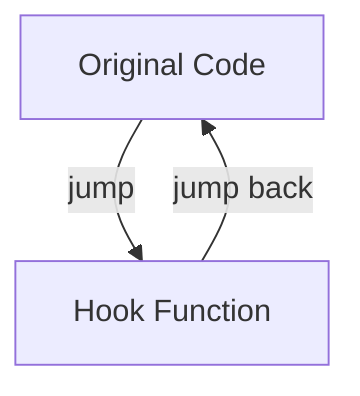
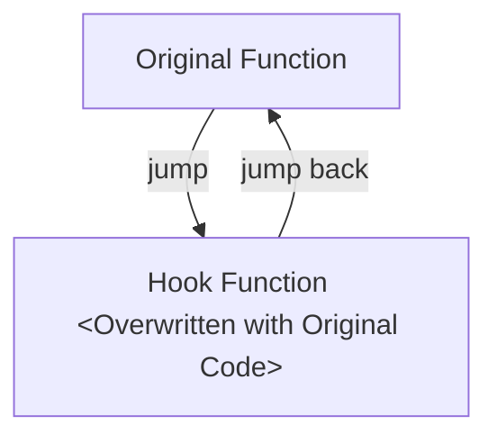

# Assembly Hooks

!!! info "Replacing arbitrary assembly sequences (a.k.a. 'mid function hooks')."

!!! info "This hook is used to make small changes to existing logic, for example injecting custom logic for existing conditional branches (`if` statements)."

!!! warning "Limited effectiveness if [Code Relocation](../../arch/overview.md#code-relocation) is not available."

!!! note "I'm not a security person/researcher. I just make full stack game modding tools, mods and libraries. Naming in these design docs might be unconventional."

This hook works by injecting a `jmp` instruction inside the middle of an arbitrary assembly sequence
to custom code. The person using this hook must be very careful not to break the program 
(corrupt stack, used registers, etc.).

## High Level Diagram

### Key

- `Original Code`: Middle of an arbitrary sequence of assembly instructions where a `branch` to custom code is placed.  
- `Hook Function`: Contains user code, including original code (depending on user preference).  
    - When the hook is deactivated, this contains the original code only.
- `Original Stub`: Original code (used when hook disabled).  

### When Activated



When the hook is activated, a `branch` is placed in the middle of the original assembly instruction
sequence to your hook code.

Your code (and/or original code) is then executed, then it branches back to original code.

### When Deactivated



When the hook is deactivated, the 'Hook Function' is overwritten in-place with original instructions 
and a jump back to your code.

## Usage Notes

!!! note "Assembly Hooks should allow both Position Independent Code and Position Relative Code"

With that in mind, the following APIs should be possible: 

```rust
/// Creates an Assembly Hook given existing position independent assembly code,
/// and address which to hook.
/// # Arguments
/// * `hook_address` - The address of the function or mid-function to hook.
/// * `asm_code` - The assembly code to execute, precompiled.
fn from_pos_independent_code_and_function_address(hook_address: usize, asm_code: &[u8]);

/// Creates an Assembly Hook given existing position assembly code,
/// and address which to hook.
/// 
/// # Arguments
/// * `hook_address` - The address of the function or mid-function to hook.
/// * `asm_code` - The assembly code to execute, precompiled.
/// * `code_address` - The original address of asm_code. 
/// 
/// # Remarks
/// Code in `asm_code` will be relocated to new target address. 
fn from_code_and_function_address(hook_address: usize, asm_code: &[u8], code_address: usize);

/// Creates an Assembly Hook given existing position assembly code,
/// and address which to hook.
/// 
/// # Arguments
/// * `hook_address` - The address of the function or mid-function to hook.
/// * `asm_isns` - The assembly instructions to place at this address.
/// 
/// # Remarks
/// Code in `asm_code` will be relocated to new target address. 
fn from_instructions_and_function_address(hook_address: usize, asm_isns: &[Instructions]);
```

!!! note "Using overloads for clarity, in library all options should live in a struct."

Code using `from_code_and_function_address` is to be preferred for usage, as users will be able to use
relative branches for improved efficiency. (If they are out of range, hooking library will rewrite them)

For pure assembly code, users are expected to compile code externally using something like `FASM`, 
put the code in their program/mod (as byte array) and pass that directly as `asm_code`.

For people who want to call their own program/mod(s) from assembly, there will be a wrapper API around
`Jit<TRegister>` and its various [Operations](../../arch/operations.md). This API will be cross-architecture and
should contain all the necessary operations required for setting up stack/registers and calling user code.

Programmers are also expected to provide 'max allowed hook length' with each call.

## Hook Lengths

!!! note "The expected hook lengths for each architecture"

When using the library, the library will use the most optimal possible `jmp` instruction to get to the user hook.  

When calling one of the functions to create an assembly hook, the end user should specify their max permissible assembly hook length.  

If a hook cannot be satisfied within that constraint, then library will throw an error.

The following table below shows common hook lengths, for:  

- `Relative Jump` (best case)  
- [Targeted Memory Allocation (TMA)](../../platform/overview.md#recommended-targeted-memory-allocation) (expected best case) when above `Relative Jump` range.  
- Worst case scenario.  

| Architecture   | Relative            | TMA          | Worst Case      |
|----------------|---------------------|--------------|-----------------|
| x86^[1]^       | 5 bytes (+- 2GiB)   | 5 bytes      | 5 bytes         |
| x86_64         | 5 bytes (+- 2GiB)   | 6 bytes^[2]^ | 12 bytes^[3]^   |
| x86_64 (macOS) | 5 bytes (+- 2GiB)   | 12 bytes^[4]^| 12 bytes^[3]^   |
| ARM64          | 4 bytes (+- 128MiB) | 12 bytes^[6]^| 24 bytes^[5]^   |
| ARM64 (macOS)  | 4 bytes (+- 128MiB) | 8 bytes      | 24 bytes^[5]^   |

^[1]^: x86 can reach any address from any address with relative branch due to integer overflow/wraparound.  
^[2]^: [`jmp [<Address>]`, with &lt;Address&gt; at &lt; 2GiB](../../arch/operations.md#jumpabsoluteindirect).  
^[3]^: [`mov <reg>, address` + `call <reg>`](../../arch/operations.md#jumpabsolute).  
^[4]^: macOS restricts access to `< 2GiB` memory locations, so absolute jump must be used.  
^[5]^: [MOVZ + MOVK + LDR + BR](../../arch/operations.md#jumpabsolute).  
^[6]^: [ADRP + ADD + BR](../../arch/operations.md#jumprelative).  

## Legacy Compatibility Considerations

!!! note "As `reloaded-hooks-rs` intends to replace `Reloaded.Hooks` is must provide certain functionality for backwards compatibility."

!!! info "Once `reloaded-hooks-rs` releases, the legacy `Reloaded.Hooks` will be a wrapper around it."

This means a few functionalities must be supported here:

- Setting arbitrary 'Hook Length'.
    - This is the amount of bytes stolen from the original code to be included as 'original code' in hook.
    - On x86 `Reloaded.Hooks` users create an ASM Hook (with default `PreferRelativeJump == false` and `HookLength == -1`) the wrapper for legacy API must set `'Hook Length' == 7` to emulate absolute jump size.
    - Respecting `MaxOpcodeSize` from original API should be sufficient.

- Supporting Assembly via FASM.
    - As this is only possible in Windows (FASM can't be recompiled on other OSes as library), this feature will be getting dropped.
    - The `Reloaded.Hooks` wrapper will continue to ship FASM for backwards compatibility, however mods are expected to migrate to the new library in the future.