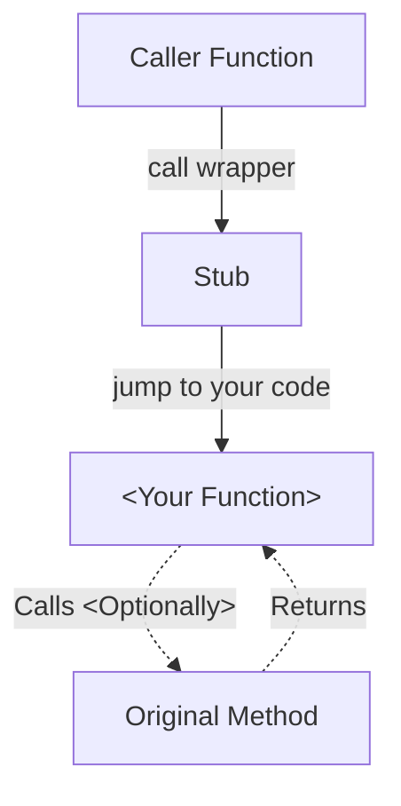
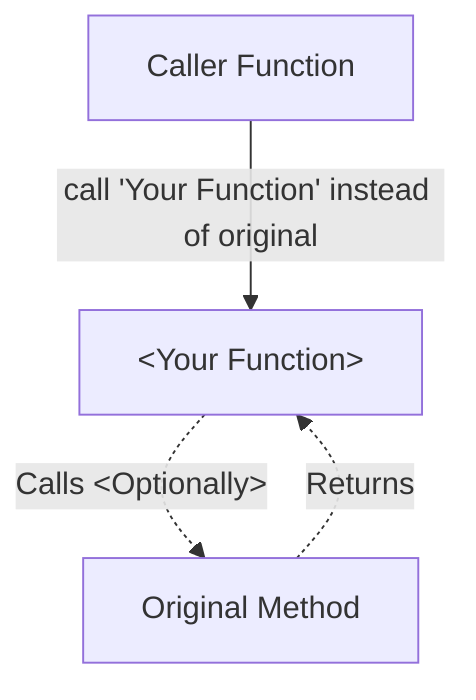
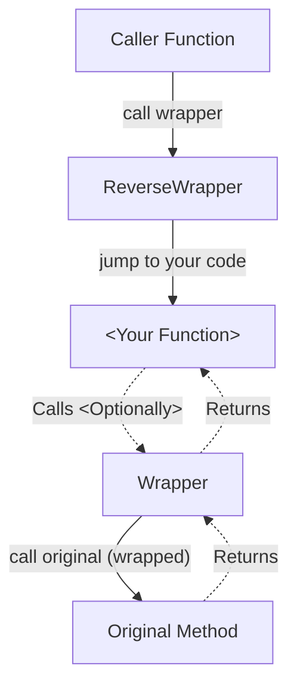
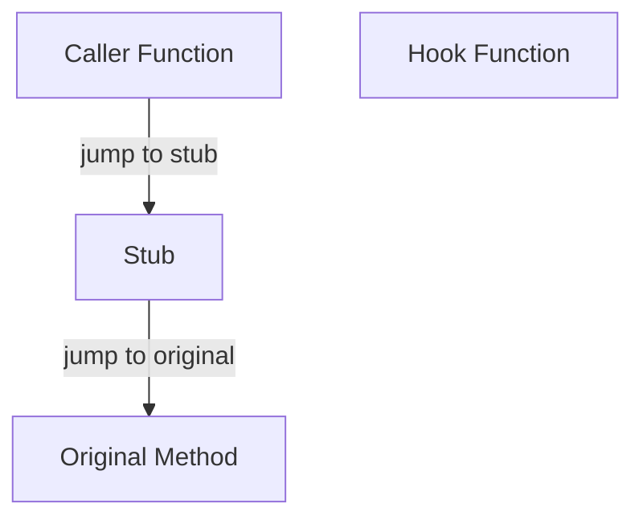

# Branch Hooks

!!! info "Replaces a `branch` (call/jump) to an existing method with a new one."

!!! info "This hook is commonly used when you want to change behaviour of a function, but only for certain callers."

    For example, if you have a method `Draw2DElement` that's used to draw an object to the screen, but
    you only want to move a certain element that's rendered by `Draw2DElement`, you would use a Branch Hook
    to replace `call Draw2DElement` to `call YourOwn2DElement`.

!!! warning "Only guaranteed to work on platforms with [Targeted Memory Allocation](../../platform/overview.md#recommended-targeted-memory-allocation)"

    Because the library needs to be able to acquire memory in proximity of the original function.  

    Usually this is almost always achievable, but cases where Denuvo DRM inflates ARM64 binaries 
    (20MB -> 500MB) may prove problematic as ARM64 has +-128MiB range for relative jumps.

!!! note "I'm not a security person/researcher. I just make full stack game modding tools, mods and libraries. Naming in these design docs might be unconventional."

This hook works by replacing the target of a `call` (a.k.a. Branch with Link) instruction with a new target.

## Comparison with [Function Hook](../function-hooks/overview.md)

!!! tip "A Branch Hook is really a specialised variant of [function hook](../function-hooks/overview.md)."

Notably it differs in the following ways:

- There is no [Wrapper To Call Original Function](../function-hooks/overview.md#when-activated-in-fast-mode) as no instructions are stolen.  
    - Your method will directly call original instead. 

- You `call` the [ReverseWrapper](../common.md#reversewrappers) instead of `jump`ing to it.
- Code replacement is at caller level rather than function level.

## High Level Diagram

### Key

- `Caller Function`: Function which originally called `Original Method`.  
- `ReverseWrapper`: Translates from original function calling convention to yours. Then calls your function.  
- `<Your Function>`: Your Rust/C#/C++/Asm code.
- `Original Method`: Original method to be called.  

### When Activated



### When Activated in 'Fast Mode'

!!! info "'Fast Mode' is an optimisation that inserts the jmp to point directly into your code when possible."



This option allows for a small performance improvement, saving 1 instruction and some instruction prefetching load. 

This is on by default (can be disabled), and will take into effect when no conversion between calling conventions is needed.

### When Activated (with Calling Convention Conversion)



### When Deactivated



When the hook is deactivated, the stub is replaced with a direct jump back to the original function.

By bypassing your code entirely, it is safe for your dynamic library (`.dll`/`.so`/`.dylib`) 
to unload from the process.

## Thread Safety, Memory Layout & State Switching

!!! info "Common: [Thread Safety & Memory Layout](../common.md#hook-memory-layouts--thread-safety)"

### Stub Memory Layout

The 'branch hook' stub uses the following memory layout:

```text
- [Branch to Hook Function / Branch to Original Function]
- Branch to Hook Function
- Branch to Original Function
```

If calling convention conversion is needed, the layout looks like this:

```
- [ReverseWrapper / Branch to Original Function]
- ReverseWrapper
- Branch to Original Function
- Wrapper
```

!!! tip "The library is optimised to not use redundant memory"

    For example, in x86 (32-bit), a `jmp` instruction can reach any address from any address. In that situation,
    we don't write `Branch to Original Function` to the buffer at all, provided a `ReverseWrapper` is not needed,
    as it is not necessary.

#### Examples

!!! info "Using x86 Assembly."

##### Before

```asm
originalCaller:
    ; Some code...
    call originalFunction
    ; More code...
```

##### After (Fast Mode)

```asm
originalCaller:
    ; Some code...
    call userFunction ; To user method
    ; More code...

userFunction:
    ; New function implementation...
    call originalFunction ; Optional.
```

##### After

```asm
; x86 Assembly
originalCaller:
    ; Some code...
    call stub
    ; More code...

stub:
    ; == BranchToHook ==
    jmp newFunction
    ; == BranchToHook ==

    ; == BranchToOriginal ==
    jmp originalFunction
    ; == BranchToOriginal ==

newFunction:
    ; New function implementation...
    call originalFunction ; Optional.
```

##### After (with Calling Convention Conversion)

```asm
; x86 Assembly
originalCaller:
    ; Some code...
    call stub
    ; More code...

stub:
    ; == ReverseWrapper ==
    ; implementation..
    call userFunction
    ; ..implementation
    ; == ReverseWrapper ==

    ; == Wrapper ==
    ; implementation ..
    jmp originalFunction
    ; .. implementation
    ; == Wrapper ==

    ; == BranchToOriginal ==
    jmp originalFunction ; Whenever disabled :wink:
    ; == BranchToOriginal ==
    
userFunction:
    ; New function implementation...
    call wrapper; (See Above)
```

##### After (Disabled)

```asm
; x86 Assembly
originalCaller:
    ; Some code...
    call stub
    ; More code...

stub:
    <jmp to `jmp originalFunction`> ; We disable the hook by branching to instruction that branches to original
    jmp originalFunction ; Whenever disabled :wink:

newFunction:
    ; New function implementation...
    call originalFunction ; Optional.

originalFunction:
    ; Original function implementation...
```