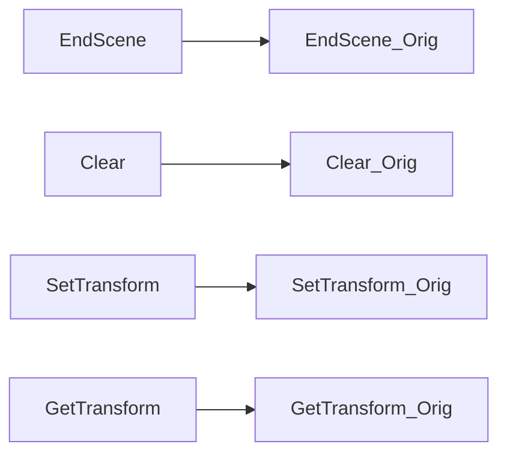
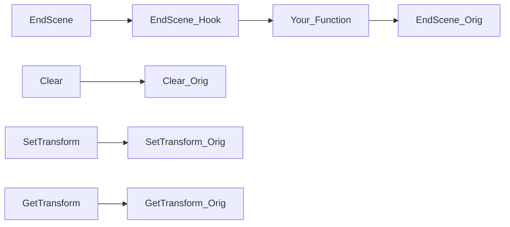

# VTable Hooks

!!! info "Replaces a pointer inside an array of function pointers with a new pointer."

!!! info "This hook is commonly used to hook `COM` objects, e.g. `Direct3D`."

!!! note "I'm not a security person/researcher. I just make full stack game modding tools, mods and libraries. Naming in these design docs might be unconventional."

Probably the simplest hook out of them all, it's simply replacing one pointer inside an array of function
pointers with a new one.

## About VTables

!!! info "VTables, are what is used to support polymorphism in C++ and similar languages."

They are the mechanism that enables calling correct functions in presence of inheritance and virtual functions.

Basically what drives 'interfaces' in other languages.

### VTables in MSVC & GCC

In both GCC and Visual C++, VTables are automatically created for classes that have virtual functions. 

They are located at offset 0x0 of any class, thus if you get a pointer to a class, and dereference offset
0x0, you'll be at the address of the first item in the VTable.

=== "C++"

    ```cpp
    class Item {
        virtual void doSomething();
        int k;
    };
    ```
    
=== "Memory Layout"

    ```
    class Item
        void* vTable
        int k
    ```

    ```
    vTable:
        void* doSomething
    ```

VTables exist in `.rdata`, thus you need to change memory permissions when hooking them.

#### VTables in COM Objects

One notable thing about COM is that all interfaces inherit from [IUnknown](https://learn.microsoft.com/en-us/windows/win32/api/unknwn/nn-unknwn-iunknown),
so the first 4 methods will always be the 4 methods of `IUnknown`.

## High Level Diagram

!!! note "Using Direct3D9 as an example"

### Before



### After

